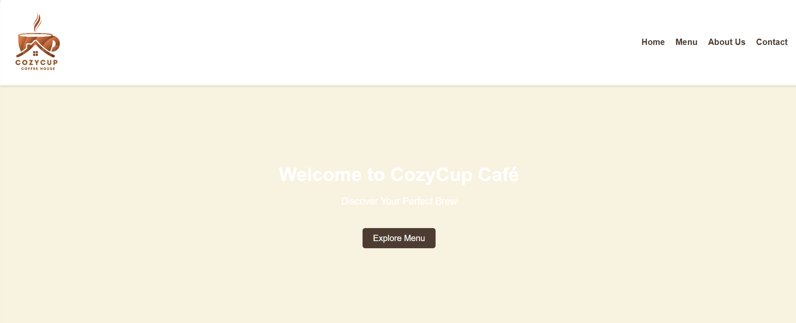
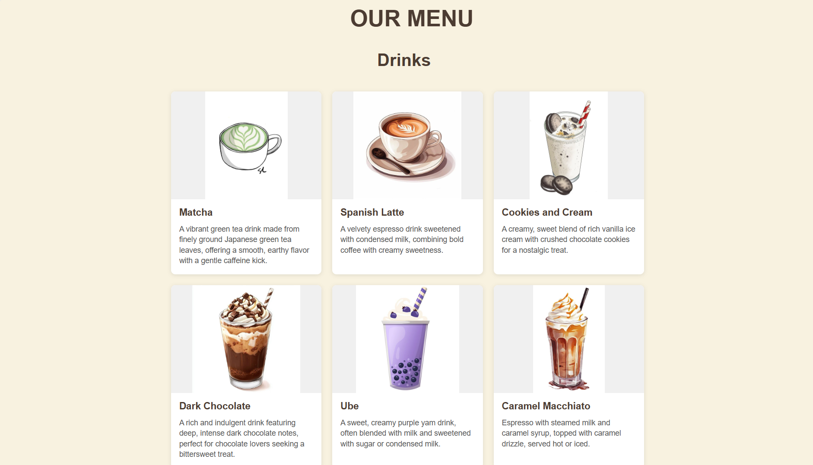
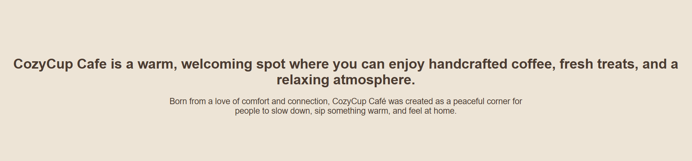

# Cozy Cup Cafe

## Project Description
A cozy cafe is a snug, welcoming spot designed for relaxation. With soft lighting, comfy seating, and a relaxed vibe, it’s the ideal place to enjoy the rich aroma of freshly brewed coffee or tea. The menu usually offers delicious pastries, sandwiches, and desserts, making it a great place to unwind, read, or catch up with friends.

## Feature

<ul>
    <li>Menu: A list of signature drinks (like Ube,  Spanish latte, caramel macchiatos), seasonal specials, and custom drink options.</li> 
    <li>About Us: A cozy, welcoming brand story emphasizing quality, sustainability, or local ingredients.</li> 
    <li>Contact Us: A form for feedback, customer service inquiries, or event bookings.</li> 

</ul>

## Screen Capture

Here are some visuals from the cozy cup cafe project

## About the Authors

" width="150" style="border-radius:50%;" alt="Author Avatar">

**Name:** Figueroa, Mark Aaron C.

**Email:** 202380293@psu.palawan.edu.ph

**Name:** Aying, Francis D.

**Email:** 202380214@psu.palawan.edu.ph

## Contact Us

Figueroa

 

 

Aying

 

